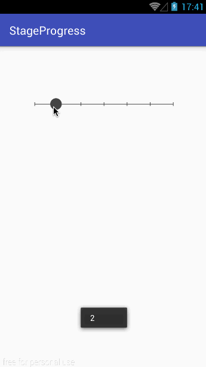

# StageProgress


# 效果图




# 用法

build.gradle文件添加引用即可
compile 'com.liuyq:stageprogress:1.0.1'

布局代码
```xml
<?xml version="1.0" encoding="utf-8"?>
<RelativeLayout xmlns:android="http://schemas.android.com/apk/res/android"
    xmlns:tools="http://schemas.android.com/tools"
    android:id="@+id/activity_main"
    android:layout_width="match_parent"
    android:layout_height="match_parent">

    <com.company.libray.StageProgressBar
        android:id="@+id/progressBar"
        android:layout_width="match_parent"
        android:layout_height="100dp"
        android:layout_margin="50dp"/>
</RelativeLayout>
```

Java代码
```java
package com.company.project;

import android.support.v7.app.AppCompatActivity;
import android.os.Bundle;
import android.widget.Toast;

import com.company.libray.StageProgressBar;

public class MainActivity extends AppCompatActivity {

    StageProgressBar progressBar;

    @Override
    protected void onCreate(Bundle savedInstanceState) {
        super.onCreate(savedInstanceState);
        setContentView(R.layout.activity_main);

        progressBar = (StageProgressBar) findViewById(R.id.progressBar);

        //设置总进度数
        progressBar.setMaxSpaceCount(6);

        //设置当前进度
        progressBar.setCurProgress(0);
        progressBar.setProgressChanged(new StageProgressBar.IProgressChanged() {
            @Override
            public void onChanged(int progress) {
                Toast.makeText(MainActivity.this, ""+progress, Toast.LENGTH_SHORT).show();
            }
        });
    }
}
```
内部实现逻辑，请下载源码进行分析，千万不要吐槽我 .^_^.